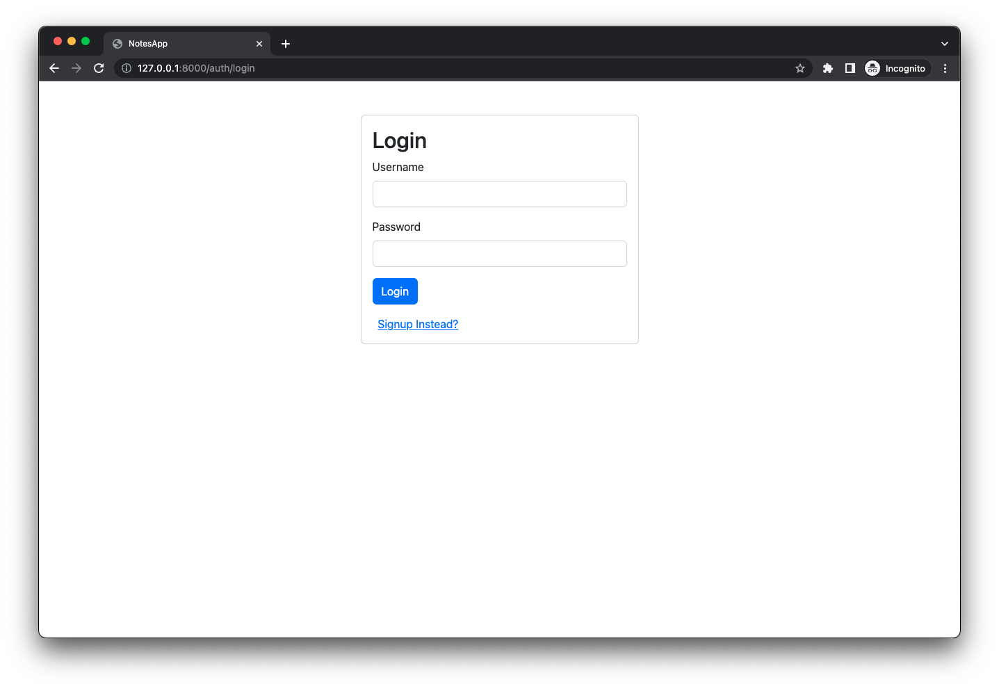
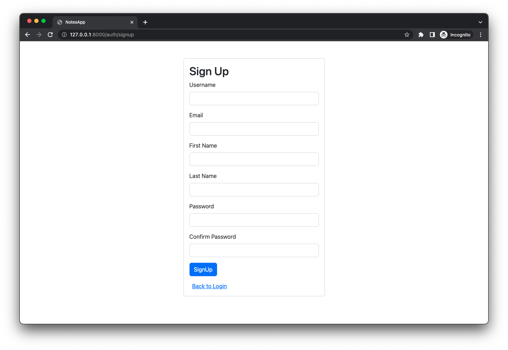
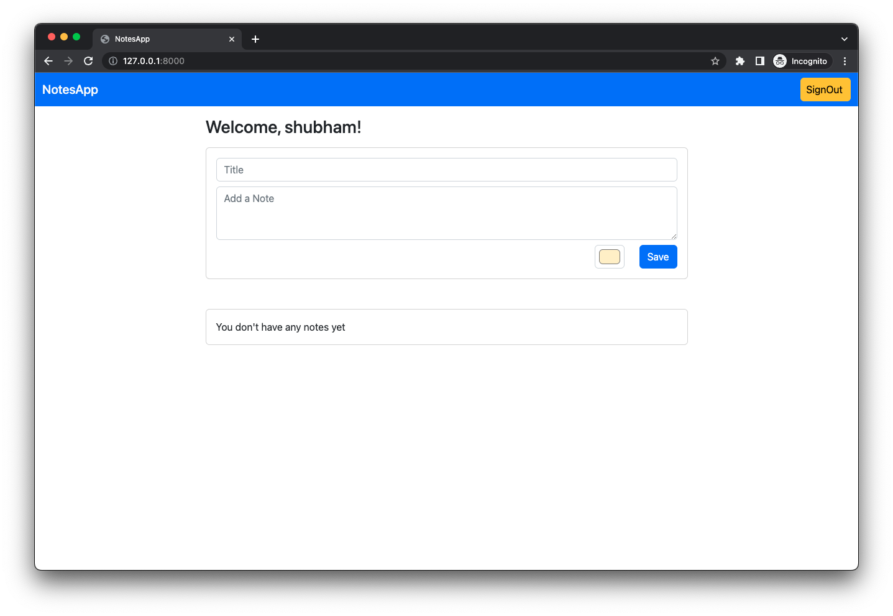
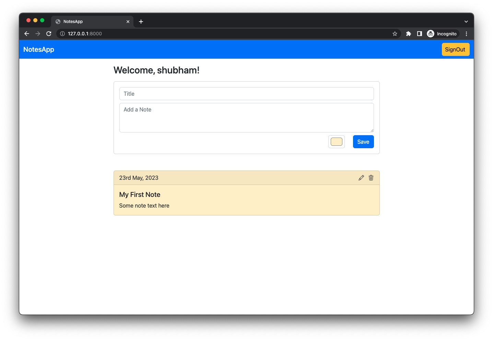
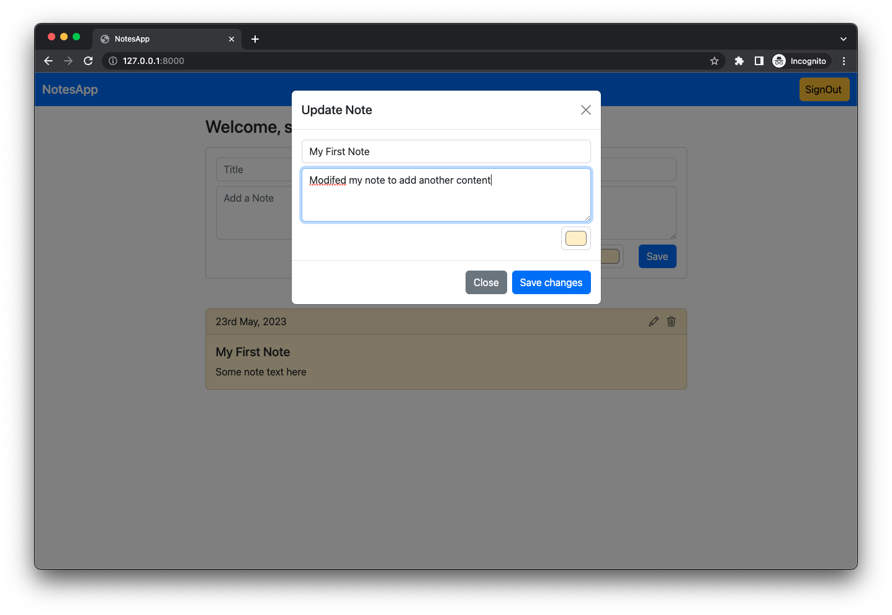
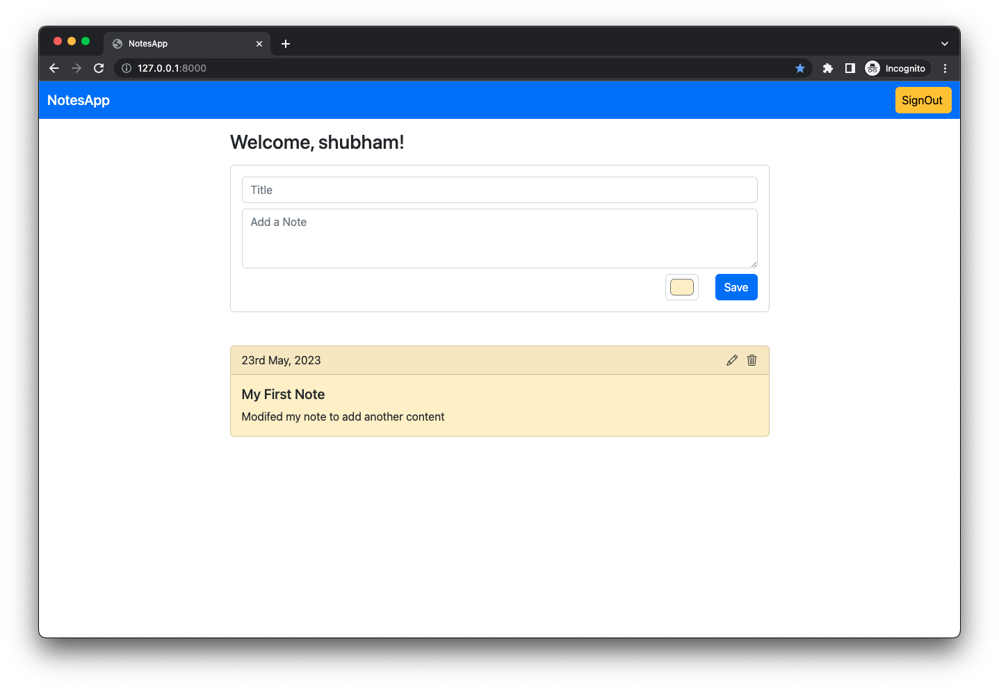
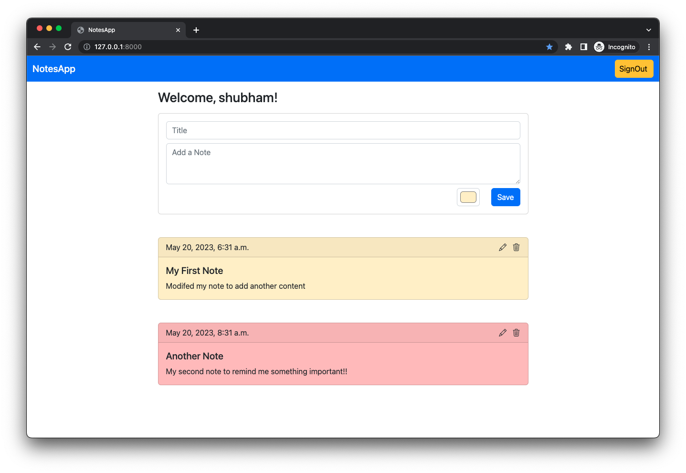
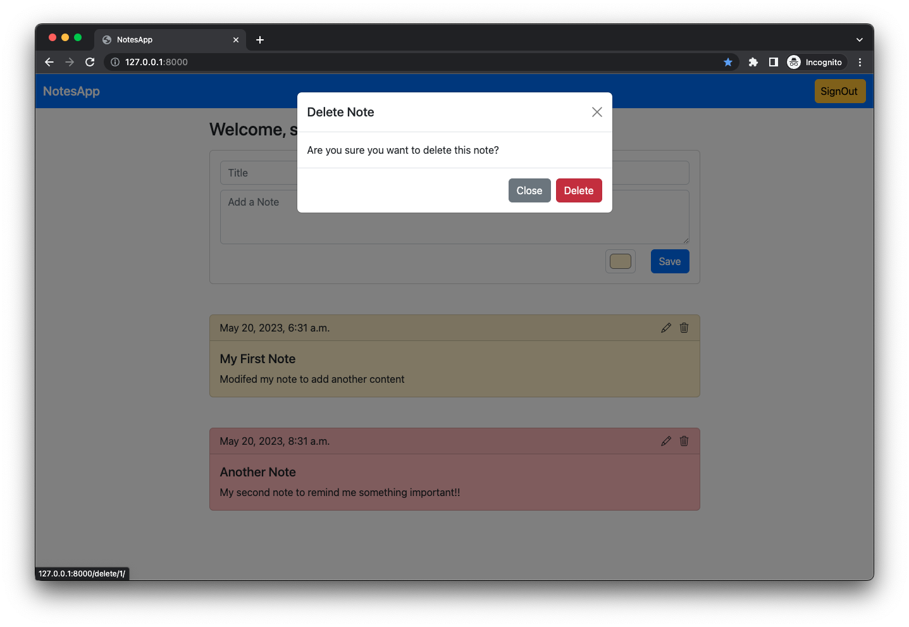
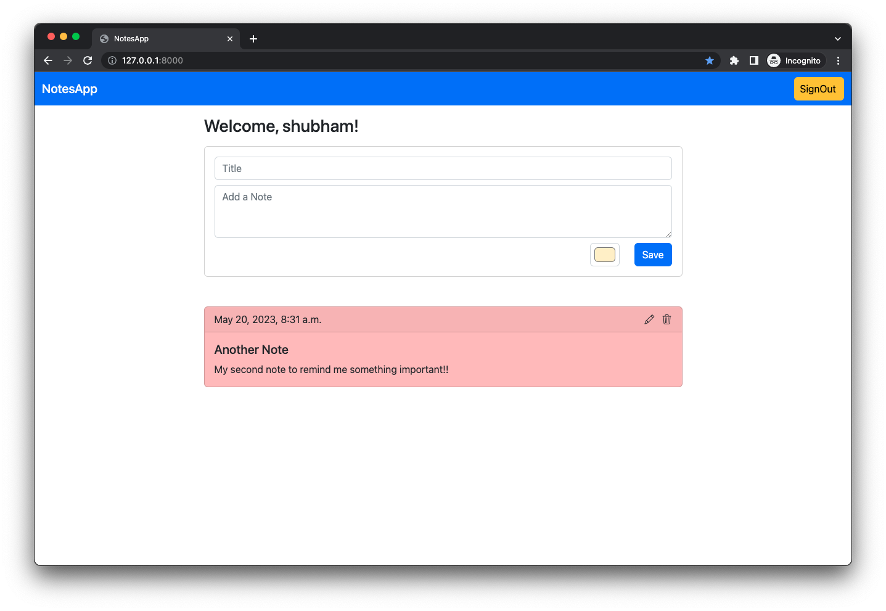

# Notes App
Using Django and Bootstrap


## Project Setup

1. Create virtual env using `python3 -m venv venv`
2. After activating virtual env, install django using `pip install django`
3. Change directory to root folder and perform DB migrations
```
    python manage.py makemigrations
    python manage.py migrate
```
4. Start server using `python manage.py runserver`

## Functionality

- Log in
    - via username & password
- Create an account
- Log out
- Add new note with Title, Description and Color
- Update Note
- Delete Note

## Screenshots

| Log In | Create an account | Home page |
| -------|--------------|-----------------|
|  |  |  |

| Add Note | Modify Note | Note Modified |
| ---------------|------------------|-----------------|
|  |  |  |

| Add Another Note | Delete Note | Note Deleted |
| ---------------|------------------|-----------------|
|  |  |  |
